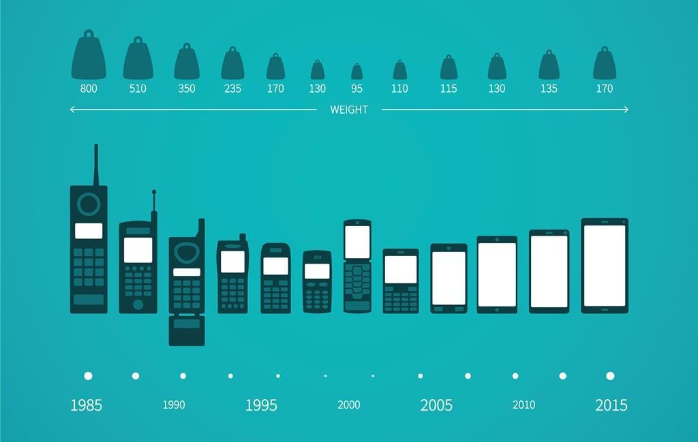

# 

# 📱 Mobile Price Classification Using Machine Learning

## 📌 Project Overview
This project aims to classify mobile phones into different price ranges based on their features. Using machine learning models, we analyze key attributes such as RAM, battery power, internal memory, and processor speed to predict whether a phone falls into a low, medium, high, or premium price category. This project provides valuable insights for manufacturers and retailers to position their products strategically in the market.

## 📂 Table of Contents
- [Dataset](#dataset)
- [Methodology](#methodology)
- [Models Used](#models-used)
- [Evaluation Metrics](#evaluation-metrics)
- [Results](#results)
- [How to Run the Notebook](#how-to-run-the-notebook)
- [Requirements](#requirements)
- [Conclusion](#conclusion)

## 📊 Dataset
This dataset, sourced from [Kaggle](https://www.kaggle.com/datasets/iabhishekofficial/mobile-price-classification), contains sales data from various mobile manufacturers.

### Features:
- **Battery Power**
- **Bluetooth Availability**
- **Clock Speed (Processor Speed)**
- **Front & Primary Camera Megapixels**
- **Internal Memory & RAM**
- **Screen Resolution & Pixel Density**
- **Mobile Weight**
- **4G & 5G Support**
- **Price Range (Target Variable: 0 = Low, 1 = Medium, 2 = High, 3 = Premium)**

### Data Preprocessing:
- Handling missing values
- Feature scaling and normalization
- Splitting into training and test sets

## 🔍 Methodology
1. **Exploratory Data Analysis (EDA):** Understanding data distributions and correlations.
2. **Feature Engineering:** Selecting and transforming relevant features for better predictions.
3. **Model Training:** Applying various classification models.
4. **Hyperparameter Tuning:** Optimizing models for maximum accuracy.
5. **Model Evaluation:** Assessing performance using classification metrics.

## 🤖 Models Used
- **Logistic Regression**
- **Decision Tree Classifier**
- **Random Forest Classifier**
- **Support Vector Machine (SVM)**
- **Gradient Boosting (XGBoost, LightGBM, CatBoost)**

## 📈 Evaluation Metrics
- **Accuracy**
- **Precision, Recall, and F1-Score**
- **Confusion Matrix Analysis**
- **ROC-AUC Score**

## 🚀 Results
- Feature importance analysis revealed **RAM, battery power, and processor speed** as key factors in price classification.
- **Random Forest and Gradient Boosting models** provided the best classification accuracy.
- Model tuning improved predictive performance, making classification robust across different price categories.

## 🛠️ How to Run the Notebook
1. Clone the repository:
   ```bash
   git clone https://github.com/<your-username>/classical-ml-projects.git
   cd classical-ml-projects/mobile_price_classification
   ```
2. Install dependencies:
   ```bash
   pip install -r requirements.txt
   ```
3. Open the Jupyter Notebook:
   ```bash
   jupyter notebook Mobile_price_classification.ipynb
   ```
4. Run all cells to train models and evaluate results.

## ⚙️ Requirements
Ensure you have the following Python libraries installed:
```bash
pandas  
numpy  
matplotlib  
seaborn  
scikit-learn  
xgboost  
lightgbm  
catboost  
```

## 📌 Conclusion
This project successfully classifies mobile phones into price categories based on key technical specifications. Feature selection and model tuning significantly improve classification accuracy, making this a valuable tool for mobile manufacturers and retailers.

💡 *Future enhancements may include deep learning models for more precise classification!*

